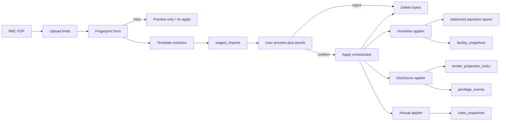
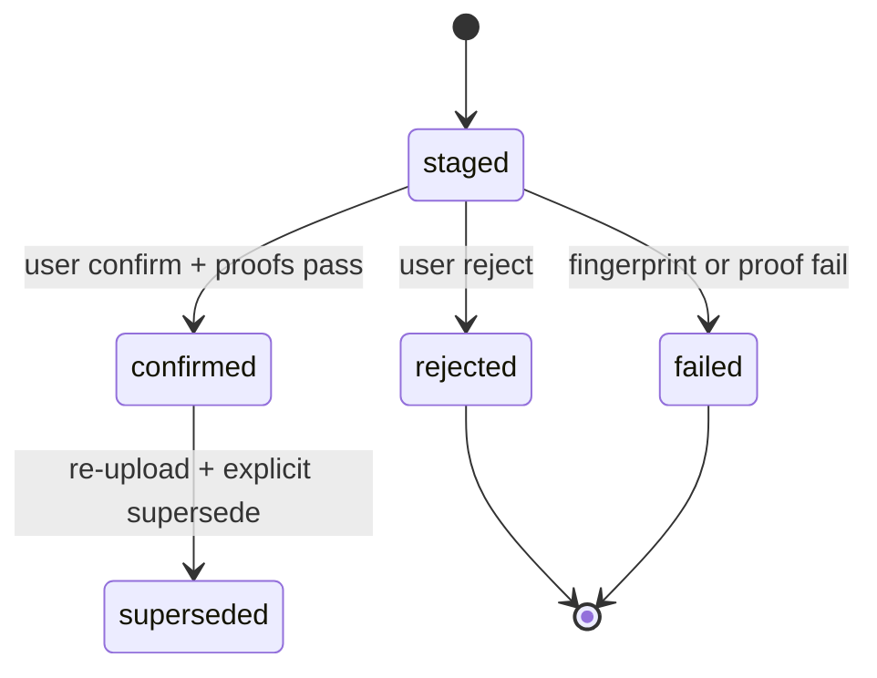
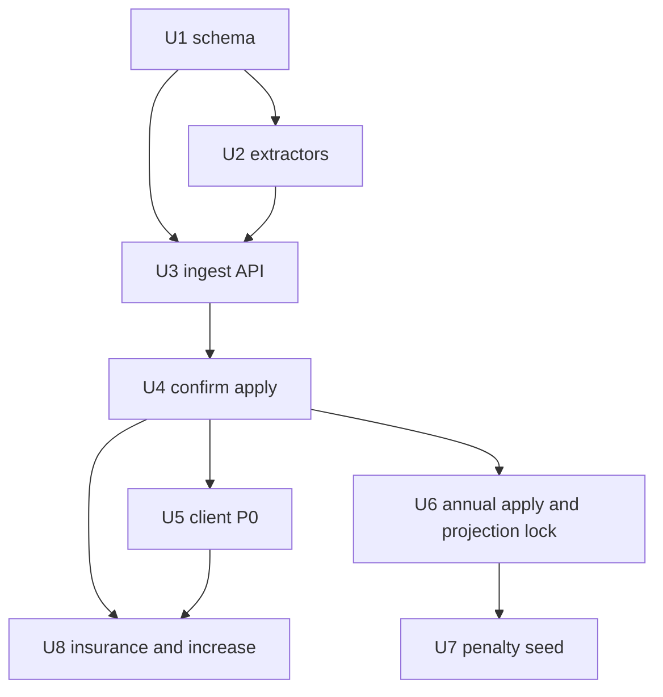

# Homeline Document Opportunity Backlog - Plan

Product Contract created via ce-plan-bootstrap from the session PO backlog. No upstream brainstorm. Product Contract preservation: n/a (new artifact).

## Goal Capsule

Ship a confirm-before-apply ingest path for the three RBC document types already in `raw/mortage-docs/`, then apply those facts to privilege accounting, the Homeline facility, lender projections, and later insurance / payment-increase recommendations.

Authority: session-settled PO backlog owns what and why. Mortgage Domain Expert owns calculation correctness. This plan owns how. Do not invent lender rules that contradict the annual statement or disclosures in `raw/mortage-docs/`.

Stop if a PDF cannot be fingerprinted as one of the three known forms. Stop if apply would route statement facts through `MortgagePaymentService.create()` (that path forces `calculated` and overwrites splits). Do not add Open Banking, generic multi-lender document AI, or a Smith Maneuver CTA while the HELOC rate exceeds the mortgage rate.

Execution: implement units in dependency order. P0 (U1–U5) is the first shippable slice. P1 (U6–U7) and P2 (U8) are specified now so later slices do not invent product. Tail: `ce-work` or an equivalent executor owns implementation, tests, and cleanup of abandoned attempts.

---

## Product Contract

### Summary

The raw RBC files describe a Homeline facility, five privilege levers, and lender cost-of-borrowing restatements. The app today uses a hand-built payment ledger and prime path. This work turns each new PDF into a staged preview the user confirms, then writes statement-sourced facts without editing JSON.

### Problem Frame

Manual transcription into `raw/mortage-docs/home-line/rbc-reconciliation-target.json` plus `scripts/reconcile-mortgage.ts` is the only statement apply path. Homeline monthly PDFs do not include a principal/interest split. Extra dollars are stored as `prepaymentAmount`, so Double-Ups consume the 10% lump-sum room. Credit room is calculated at 100% of principal paydown. The live statements show about 81% and a $0 HELOC draw. Lender interest-to-end-of-term and the unused payment-increase privilege are not stored.

### Key Decisions

- KD1. Build the published backlog in order (ingest, privileges, Homeline, then projection lock and dual clock, then penalty seed, then insurance and payment-increase). (session-settled: user-directed — chosen over a P0-only plan: later slices must not invent product.) Governs R1, R2, R3, R4, R5, R6, R7, R8.
- KD2. Extractors stay RBC Homeline monthly, cost-of-borrowing disclosure, and annual mortgage statement only. (session-settled: user-directed — chosen over generic multi-lender document intelligence: the corpus is three born-digital RBC forms.) Governs R1.
- KD3. Double-Up does not consume the 10% annual lump-sum. Payment-increase is a separate unused privilege. (session-settled: user-directed — chosen over one prepayment bucket: the 2025 annual statement lists them as distinct levers.) Governs R3.
- KD4. December 2025 $0 received is a missed payment, not Skip-a-Payment. (session-settled: user-directed — chosen over skip-a-payment: the annual statement reports Skip-a-Payment $0.) Governs R4.
- KD5. Persist lender-observed Homeline credit room. Do not assume 100% re-advance. Hide Smith CTAs while HELOC effective rate exceeds mortgage effective rate. (session-settled: user-directed — chosen over auto-Smith / 1:1 re-advance: Jul 2026 room is $9,989 on $12,293 principal paydown; HELOC is Prime+0.50% vs mortgage Prime−0.90%.) Governs R5.
- KD6. Confirm-before-apply. Never silent apply on upload. Governs R1, R2.
- KD7. Closed variable-rate break cost on this book is 3 months' interest plus AB switch-out $300 and discharge $0. Governs R7. Conflict: `docs/feature-specifications/PENALTY_CALCULATIONS_FEATURE_SPEC.md` seeds RBC as posted-rate IRD. The annual statement on this book is the owner.

### Requirements

#### Ingest

- R1. The user can upload one of the three known RBC PDFs, see a classified staged preview, and confirm or reject. Rejected uploads do not change the ledger.
- R2. Confirm applies only the facts that document type owns. Homeline monthly owns facility snapshot, payments received, period-end mortgage balance, HELOC room/drawn, and prime windows. A disclosure owns lender projection lock fields and a Double-Up change tag. An annual statement owns YTD P/I, privilege rules, IAD, penalty profile, switch-out/discharge fees, and arrears/accrued.

#### Privileges and payments

- R3. Privilege year follows the Interest Adjustment Date (anniversary). Track lump-sum (10% of original), Double-Up (per payment date, $100 to one extra regular P&I), payment-increase (10% of P&I, once per IAD year), skip-a-payment, and frequency as separate counters. Extra principal on a payment row may still exist for math. It must not be the privilege ledger.
- R4. A $0 Homeline “payments received” month with unchanged mortgage balance and Skip-a-Payment $0 on the annual statement records as missed, not skipped. Actual/365 skip UI remains blocked unless a later statement records a true skip.

#### Homeline facility

- R5. The mortgage page shows a Homeline facility: mortgage outstanding, HELOC limit, HELOC drawn, observed available credit, and observed re-advance ratio versus calculated credit room. No Smith Maneuver call-to-action while HELOC effective rate is greater than mortgage effective rate.

#### Lender locks and later slices

- R6. Each confirmed disclosure stores lender interest-to-end-of-term, P&I-to-end-of-term, triggering annual rate, next due date, rate reduction, remaining term, and remaining amortization, and shows them next to the app projection.
- R7. Refinance and break-cost math on this mortgage default to 3-month interest, AB switch-out $300, and discharge $0 after the annual statement is confirmed.
- R8. After P0/P1 facts exist, show LoanProtector on the HELOC ($0.65 per $1,000 outstanding per payment; $0 while drawn is $0) as distinct from CMHC, and recommend the unused payment-increase privilege against remaining IAD-year room.

### Actors

- A1. The homeowner who holds this RBC Homeline book (dogfood first).
- A2. A later RBC Homeline holder using the same three form families.

### Key Flows

- F1. Homeline monthly: upload → classify → extract → preview (facility + payment amount + balance, no lender P/I) → confirm or reject → apply snapshot and payment row. Covers R1, R2, R4, R5.
- F2. Cost-of-borrowing disclosure: upload → extract projection + Double-Up flag → confirm → lock projection and tag the matching payment privilege. Confirm is blocked if no Homeline payment exists for that period. Covers R1, R2, R3, R6.
- F3. Annual statement: upload → extract YTD, rules, penalty, arrears → confirm → apply rules snapshot and dual-clock anchors. Covers R1, R2, R3, R4, R7.
- F4. Re-upload of a confirmed `(mortgage, doc type, period)`: block auto-apply, show diff, require explicit supersede + re-confirm. Covers R1.
- F5. Fingerprint miss, empty text layer, or opening balance ≠ last confirmed closing: block apply, keep preview, do not write. Covers R1, R2.

### Acceptance Examples

- AE1. Confirming `Homeline Plan Statement-4001 2026-07-31.pdf` stores observed available credit $9,989.35, HELOC drawn $0.00, mortgage outstanding $282,105.53, and payments received $2,500.69. Covers R2, R5.
- AE2. After the matching Homeline monthlies are confirmed, confirming the Jun/Jul/Aug 2026 disclosures tags those $1,000 extras as Double-Up and leaves lump-sum used at $0. Covers R3.
- AE3. Confirming the 2025 annual statement records Skip-a-Payment $0, interest in arrears $844.27, accrued $846.74, IAD 2025-01-02, and does not mark December as skipped. Covers R4, R7.
- AE4. A Homeline monthly PDF never creates a Smith CTA while HELOC rate is 4.95% and mortgage rate is 3.55%. Covers R5.
- AE5. Re-uploading the same July 2026 Homeline period after confirm requires supersede. A second confirm replaces the snapshot. It does not insert a duplicate payment. Covers F4.
- AE6. After the Aug 14 2026 disclosure is confirmed, the UI shows lender interest-to-end-of-term $32,348.86 next to the app projection. Covers R6.

### Success Criteria

P0: a new Homeline PDF can be applied without editing JSON. Double-Up dollars and unclassified extras do not reduce displayed lump-sum used. HELOC available credit matches the latest confirmed Homeline statement within $1. No Smith CTA while HELOC rate exceeds mortgage rate.

P1: lender interest-to-EOT is stored and visible. Annual confirm finalizes privilege-year room, missed-vs-skip, and break-cost defaults.

### Scope Boundaries

In scope: the three RBC form families, confirm-before-apply, privilege counters, observed Homeline facility, lender projection lock, statement-vs-payment dual clock, RBC break-cost seed, LoanProtector display, payment-increase recommendation.

Out of this product's identity: Open Banking, screen scraping, auto-drawing the HELOC, a document vault that does not extract fields, generic multi-lender OCR/LLM extraction, treating December 2025 as Skip-a-Payment.

Deferred for later: real session auth beyond the `requireUser` stub, optional encrypted PDF retain, payment-correction recalc, skip-payment UI wiring for non-actual-365 books, multi-lender templates.

Deferred to follow-up work: closing the committed `migrations/0000_abandoned_norrin_radd.sql` drift for unrelated WIP columns.

In P0, not deferred: mortgage ownership checks on every ingest route, `ENABLE_STATEMENT_INGEST` production gate, staging TTL, and no PDF blob column.

### Sources

- Session PO backlog and canvas analysis of `raw/mortage-docs/`.
- `scripts/reconcile-mortgage.ts` and `raw/mortage-docs/home-line/rbc-reconciliation-target.json`.
- `docs/strategic/AI_INTEGRATION_STRATEGY.md` (extract → confirm → apply).
- Annual statement privilege and penalty pages in `raw/mortage-docs/`.

---

## Planning Contract

### Key Technical Decisions

- KTD1. Use `unpdf@1.7.0` (Node 20 / `@types/node` 20.16.11) to obtain positioned text items via the document proxy. Do not use flattened `extractText()` as extractor input. Do not add `pdf-parse` v1. (Instantiates KD2 / R1.)
- KTD2. Ingest state machine is upload → classify → extract → staged row → preview → confirm or reject → apply. Uploaded bytes are discarded after confirm or after staging TTL. Persist content hash, template id, and extractor version only. (Instantiates KD6 / R1.)
- KTD3. Port `scripts/reconcile-mortgage.ts` validation and apply semantics into an application service. Do not call `MortgagePaymentService.create()` / `createBulk()` for statement apply. Those methods force `calculationSource: "calculated"` and overwrite splits. New `applyStatementFacts()` trusts confirmed staged facts. (Instantiates R2.)
- KTD4. When a Homeline monthly has payment amount and remaining balance but no P/I, derive `principalPaid = priorRemaining − remainingBalance` and `interestPaid = paymentAmount − principalPaid` (prepayment is the extra above regular P&I). Stamp `calculationSource: "statement"` only when the balance chain and part sums prove. (Instantiates R2.)
- KTD5. Add `privilege_events` with type and `consumesLumpSumLimit`. YTD lump-sum sums only events that consume the limit. Keep `prepaymentAmount` for principal math. (Instantiates KD3 / R3.)
- KTD6. Add `isMissed` (or `paymentStatus: missed`) distinct from `isSkipped`. Missed rows do not accrue skip interest. (Instantiates KD4 / R4.)
- KTD7. Store `facility_snapshots` from Homeline monthlies (observed limit, drawn, available, mortgage outstanding, plan total limit). Show observed beside calculated credit room. Do not overwrite calculated HELOC math with a hardcoded 81%. (Instantiates KD5 / R5.)
- KTD8. Idempotency key is `(userId, mortgageId, documentType, statementPeriod)`. Homeline payment upsert key is `(mortgageId, statementPeriod)` for statement rows. Re-upload of a confirmed key blocks apply until explicit supersede, which updates the same `payment_id`. (Instantiates F4.)
- KTD9. Accept multipart with multer 2.x `memoryStorage`, one file part, ~10 MB cap, `%PDF-` magic, page/object caps, parse timeout, and reject encrypted PDFs. Copy to a new `Uint8Array` before parse. Ignore client filenames. No disk write. No PDF blob column.
- KTD10. Specify P1 and P2 units in this plan. Do not implement them in the P0 ship. (session-settled: user-directed — chosen over a P0-only plan: later slices stay consistent with P0 facts.)
- KTD11. Homeline extra principal is math only until classified. Preview may suggest Double-Up. Homeline confirm writes no finalized `privilege_events` unless the user checks “treat as Double-Up.” Disclosure confirm is the normal authority and retro-tags by payment date. Unclassified extras do not consume lump-sum room. (Instantiates KD3 / R3.)
- KTD12. `StatementApplyService.confirm` is a thin orchestrator with one serializable transaction and the same mortgage advisory lock as `scripts/reconcile-mortgage.ts`. Three appliers: Homeline (payment + facility + primes), disclosure (locks + privilege tag), annual (rules + arrears). Port proofs, not the CLI SQL loop.
- KTD13. Statement rows are written only by a statement writer via repository upsert. `MortgagePaymentService.create`, `createBulk`, `validateAndNormalizePayment`, and `enforcePrepaymentLimit` stay off this path.
- KTD14. Statement apply never calls `HelocCreditLimitService` and never writes `heloc_accounts` from a prepay. Observed room lives on `facility_snapshots`.
- KTD15. Proofs block confirm. Preview returns the same proof results so the UI can disable Confirm. Opening balance must equal last confirmed closing unless override.
- KTD16. Annual applier writes `rules_snapshots` as source of truth and may set `prepaymentLimitResetDate` and `annualPrepaymentLimitPercent` on the mortgage in the same transaction. It does not create monthly payments.
- KTD17. Every ingest route loads the mortgage with `getByIdForUser`. Staged rows carry `userId` and `expiresAt` (24h). Confirm after expiry is 410. Ingest routes stay unmounted in production unless `ENABLE_STATEMENT_INGEST=true`.
- KTD18. First Homeline confirm on a book with no prior confirmed import uses the extracted opening/prior balance as the chain head. If a calculated payment exists for the same `statementPeriod`, confirm replaces that row (same id if present) rather than inserting a second row. If a later calculated row exists after the period, keep the existing “no edit before a later statement” rule by writing the statement row and leaving later calculated rows frozen.
- KTD19. P0 apply ships Homeline and disclosure appliers only. Annual confirm-apply ships with U6. U2 still extracts annual goldens in P0 so templates do not wait.

### High-Level Technical Design

Document facts are not ledger rows. Each PDF becomes a typed facts object. Confirm maps facts onto the domain that document owns.

Homeline monthly does not invent a P/I split from flattened text. It applies amount, remaining balance, facility, and prime windows. Disclosure does not create a payment. It locks projections and may tag an existing or just-applied payment as Double-Up. Annual statement does not create monthly rows. It locks YTD totals, privilege rules, penalty profile, and arrears/accrued.

### Assumptions

- The three form families in `raw/mortage-docs/` stay stable enough for versioned templates (CD 2402/2403, SM 3001, Homeline 06/19). A fingerprint miss fails closed.
- Existing actual/365 payment math remains the source of calculated rows. Statement apply is a separate path.
- `requireUser` injects `dev-user-001`. It is not authentication. Ingest still binds every row to that user id and the mortgage owner check. Real session auth remains follow-up.
- Extract-and-discard is acceptable because golden fixtures remain in `raw/mortage-docs/` for re-parse tests.

### Implementation Constraints

- Follow existing layering: `shared/schema.ts` → domain Zod → routes → services → repositories.
- Server tests use `tsx --test` under `server/src/**/__tests__`. Client tests use vitest.
- Keep `unpdf` external in the esbuild server bundle so font/worker files resolve from `node_modules`.
- Do not send PDFs to a third-party document API.

### Sequencing

U1 schema first. U2 extractors can start against fixtures in parallel after shared enums exist. U3 staging API depends on U1–U2. U4 apply depends on U3 and ports reconcile proofs (Homeline + disclosure only). U5 client depends on U3–U4. U6 adds annual apply plus projection lock UI. U7 depends on U6 rules snapshots. U8 depends on U4 facility + U5 privilege UI.

### Alternative Approaches Considered

- LLM / OCR document intelligence: rejected under KD2. These PDFs are born-digital. A third-party API would move PII off-box.
- Extending `MortgagePaymentService.create()` with a source flag: rejected. The method always re-normalizes splits. A parallel apply path is safer.
- Flattened regex extractors: rejected. Homeline tables are multi-column. Geometry + label binding survives wrap.
- Planning P0 only: rejected under KD1 / KTD10.

---

## Implementation Units

### U1. Domain model for ingest, privileges, and snapshots

**Goal:** Persist staged imports, privilege events, missed payments, facility snapshots, and the lock/rules tables P1 will write.

**Requirements:** R2, R3, R4, R5, R6, R7

**Dependencies:** none

**Files:**
- `shared/schema.ts`
- `shared/mortgage-ledger.ts`
- `migrations/` (new SQL for the new tables and `is_missed`)
- `server/src/domain/models/` (new ingest / privilege schemas)
- `server/src/infrastructure/repositories/` (new thin repos)
- `server/src/application/services/index.ts` (wire-up only)

**Approach:**
1. Add document-type and privilege-type enums next to `PAYMENT_CALCULATION_SOURCES`.
2. Add `staged_imports` with `userId`, `expiresAt`, status, content hash, and no blob column. Add `privilege_events`, `facility_snapshots`, `lender_projection_locks`, and `rules_snapshots`.
3. Add `isMissed` and `statementPeriod` (`YYYY-MM`) on `mortgage_payments`. Do not reuse `isSkipped`.
4. Enforce partial uniques: one active confirmed import per `(userId, mortgageId, documentType, statementPeriod)`; one statement payment per `(mortgageId, statementPeriod)` when not missed; one active facility snapshot per period. Privilege events carry `stagedImportId`.
5. Do not migrate unrelated WIP columns from the 0000 drift.

**Patterns to follow:** `shared/schema.ts` Drizzle + drizzle-zod + money/rate transforms. Repository factory in `server/src/infrastructure/repositories`.

**Test scenarios:**
- Insert schema accepts a staged Homeline monthly with period `2026-07` and status `staged`.
- Privilege event `double_up` with `consumesLumpSumLimit=false` does not fail Zod.
- `isMissed=1` and `isSkipped=1` together is rejected.
- Second active confirmed import for the same key fails the unique constraint.
- Migration applies on an empty database that already has `0000`.
- Schema has no PDF byte column.

**Verification:** `npm run check` and a repository-level insert/read test pass.

---

### U2. RBC template extractors

**Goal:** Classify and extract typed facts from the three form families using golden PDFs.

**Requirements:** R1, R2 — KTD1, KTD9

**Dependencies:** U1 (enums / fact Zod types)

**Files:**
- `server/src/application/services/statement-ingest/` (classifier + three extractors)
- `server/src/application/services/__tests__/rbc-extractors.test.ts`
- `raw/mortage-docs/` (fixtures only; do not commit new PII)

**Approach:**
1. Fingerprint header / form code (Homeline 06/19, CD 2402/2403, SM 3001).
2. Bind fields by label + nearest positioned text item. Regex only inside a boxed field.
3. Emit a Zod facts object per document type. Fail closed on fingerprint miss or empty text layer.
4. Homeline facts omit P/I. Disclosure facts include Double-Up change and COB figures. Annual facts include privilege rules, YTD, arrears, penalty text fields.

**Execution note:** Characterization-first against the existing PDFs. A wrong extract on a golden file is a failing test, not a warning.

**Patterns to follow:** Zod at the boundary. Pure functions, no DB in extractors.

**Test scenarios:**
- Happy path: July 2026 Homeline extracts available credit 9989.35, outstanding 282105.53, payments received 2500.69, HELOC drawn 0. Covers AE1.
- Happy path: Aug 14 2026 disclosure extracts Double-Up change, interest-to-EOT 32348.86, trigger 6.300%, next due 2026-09-02. Covers AE6.
- Happy path: 2025 annual extracts IAD 2025-01-02, lump-sum room 29439.90, Skip-a-Payment 0, arrears 844.27. Covers AE3.
- Edge: empty text layer fails closed.
- Edge: unknown PDF fingerprint fails closed.
- Error: oversized or non-`%PDF-` buffer is rejected before parse.

**Verification:** `npm run test:services` includes the new extractor file and the three goldens pass.

---

### U3. Ingest upload and staging API

**Goal:** Accept a PDF, run U2, persist a staged import, return a preview DTO. No ledger writes.

**Requirements:** R1 — KTD2, KTD8, KTD9

**Dependencies:** U1, U2

**Files:**
- `server/src/api/routes/statement-ingest.routes.ts`
- `server/src/api/routes/index.ts`
- `server/src/application/services/statement-ingest.service.ts`
- `server/src/application/services/__tests__/statement-ingest.service.test.ts`
- `package.json` (add `unpdf@1.7.0`, `multer@2`, `@types/multer`)

**Approach:**
1. `POST /api/mortgages/:id/statements` multipart. Stage only. Load mortgage with `getByIdForUser` first.
2. `GET /api/mortgages/:id/statements/:stagedId` returns preview, suggested privilege, and proof results. Confirm stays disabled in the DTO when proofs fail. StagedId must match URL mortgage and caller.
3. `POST .../reject` marks rejected. Bytes were never stored.
4. Confirm endpoint is 409 until U4. Do not apply here.
5. Mount ingest routes only when not production, or when `ENABLE_STATEMENT_INGEST=true`.
6. Ingest logs may include staged id, mortgage id, user id, hash, type, and status. They must not include document text, filenames, or buffers.

**Patterns to follow:** `requireUser`, Zod, `sendError`. Register in `server/src/api/routes/index.ts`.

**Test scenarios:**
- Happy path: upload July 2026 Homeline returns staged preview with facility fields and no ledger change.
- Edge: second upload of the same period while first is staged returns the existing staged row or a conflict the UI can supersede.
- Edge: upload to a mortgage the caller does not own returns 404 and writes no staged row.
- Error: fingerprint miss, encrypted PDF, oversize, or parse timeout returns 422/400, no staged row, no raw bytes in the body.
- Error: staged row past `expiresAt` returns 410 on GET, reject, and confirm.
- Error: GET/reject/confirm with a staged id that belongs to another mortgage returns 404.
- Error: production env without `ENABLE_STATEMENT_INGEST` does not mount ingest routes.
- Integration: mortgage row count and payment count unchanged after upload. No PDF blob persisted. Logs contain no filename or buffer.

**Verification:** service tests pass. A manual upload in local dev shows JSON preview only.

---

### U4. Confirm-apply, statement payments, privileges, facility

**Goal:** Confirm a staged import and write the domain facts that document owns.

**Requirements:** R2, R3, R4, R5 — KTD3, KTD4, KTD5, KTD6, KTD7, KTD8

**Dependencies:** U3

**Files:**
- `server/src/application/services/statement-apply.service.ts`
- `server/src/shared/calculations/statement-proofs.ts` (or equivalent shared proofs)
- `server/src/application/services/mortgage-payment.service.ts` (read helpers only; do not call create)
- `scripts/reconcile-mortgage.ts` (call shared proofs if a thin extract is natural; do not expand the CLI)
- `server/src/application/services/__tests__/statement-apply.service.test.ts`
- `server/src/application/services/__tests__/mortgage-payment-rbc.test.ts` (extend: statement apply does not go through create)

**Approach:**
1. Extract shared proofs (part sums, balance chain, opening-balance gate) for both apply and the reconcile CLI. Do not port the CLI SQL loop.
2. Confirm runs in one serializable transaction. Use `pg_advisory_xact_lock` on the mortgage id (raw SQL inside the Drizzle/`pg` transaction; do not assume the reconcile CLI `Pool` drops in unchanged). Re-check staged status, run proofs, dispatch the document-type applier, verify `mortgages.currentBalance` equals the latest payment remaining, then commit or roll back.
3. Homeline applier: upsert the period payment with KTD4 derived P/I; write facility snapshot and prime windows. Do not write finalized privilege events unless the user checked “treat as Double-Up.” Do not call `HelocCreditLimitService`.
4. Disclosure applier: upsert projection lock; retro-tag `privilege_events` on the matching payment date. Do not create a payment.
5. P0 does not run the annual applier (KTD19).
6. Supersede marks the prior import superseded, retracts its privilege/facility children, and updates the same payment id.
7. Expose read DTOs on the mortgage payload or `GET /api/mortgages/:id/statement-facts` for latest facility snapshot and privilege counters.
8. Keep hash + extractor version. Bytes were never stored.

**Execution note:** Implement apply test-first against the July 2026 Homeline + Aug 2026 disclosure + 2025 annual goldens.

**Patterns to follow:** statement immutability already in `mortgage-payment.service.ts`. Reconcile dry-run-then-apply posture.

**Test scenarios:**
- Happy path: confirm July 2026 Homeline writes one statement payment (2500.69, remaining 282105.53) and facility available 9989.35. Lump-sum used stays 0 if the user did not classify the extra. Covers AE1.
- Happy path: after July 2026 Homeline is confirmed, confirm the Jul 2026 disclosure creates a Double-Up event; lump-sum used stays 0. Covers AE2.
- Error: disclosure confirm with no matching Homeline payment for that period is blocked.
- Edge: confirm blocked when opening balance ≠ last confirmed closing, unless override flag is set.
- Edge: supersede same period replaces snapshot and payment, same payment id, payment count stays 1. Covers AE5.
- Edge: two parallel confirms of the same staged id yield one success and one 409; payment count +1.
- Error: confirm with mismatched URL mortgage or expired staged row is 404/410 and writes nothing.
- Error: calling existing `create()` with statement-like payload still forces calculated (characterization: current behavior unchanged).
- Error: `update()` on a statement row still throws.
- Integration: `currentBalance` on the mortgage equals the latest confirmed Homeline outstanding. Post-apply proof failure rolls back.

**Verification:** `npm run test:services` and `npm run test:calculations` stay green. Reconcile target JSON remains a valid expected ledger for the same book.

---

### U5. Client ingest, privilege, and Homeline facility

**Goal:** User-facing confirm-before-apply, privilege remaining room, facility panel, and Smith CTA gate.

**Requirements:** R1, R3, R5 — KD5, KD6

**Dependencies:** U4

**Files:**
- `client/src/features/mortgage-tracking/components/` (new ingest dialog + facility + privilege panels)
- `client/src/features/mortgage-tracking/api/mortgage-api.ts` (include statement-facts / facility / privilege reads from U4)
- `client/src/features/mortgage-tracking/components/mortgage-content.tsx`
- `client/src/features/mortgage-tracking/components/payment-history-section.tsx`
- Smith / HELOC entry points that currently deep-link a CTA (`client/src/features/heloc/`, smith-maneuver feature)
- `client/src/features/mortgage-tracking/components/__tests__/` (new)

**Approach:**
1. Upload + preview + confirm/reject. Show derived P/I as “derived from balance” when the PDF had no split.
2. Privilege panel (P0): lump-sum used (must stay 0 for unclassified extras and Double-Ups), Double-Up labels after disclosure confirm (AE2), and unclassified extra pending. Payment-increase unused $150.07 and skip counters wait for annual confirm (U6) or show “confirm annual statement.”
3. Facility panel: observed vs calculated room, $0 drawn.
4. Hide Smith CTA when HELOC effective rate > mortgage effective rate. Covers AE4.

**Patterns to follow:** existing dialogs and `calculationSource === "statement"` “Reconciled” badge. Skip-dialog confirm checkbox.

**Test scenarios:**
- Happy path: preview shows July 2026 facility numbers before confirm; payment history unchanged until confirm.
- Happy path: after Homeline confirm then disclosure confirm, history shows Reconciled and Double-Up on those extras (AE2).
- Happy path: Smith CTA hidden at 4.95% vs 3.55%. Covers AE4.
- Edge: reject leaves ledger unchanged.
- Error: fingerprint-miss preview offers no confirm button.

**Verification:** `npm run test:client` for the new tests. Manual dogfood: upload the July Homeline PDF and confirm.

---

### U6. Annual apply, lender projection lock, and dual clock

**Goal:** Confirm annual statements, show lender COB figures next to app projections, and explain statement-date vs payment-date (arrears/accrued).

**Requirements:** R6, R4, R7 — F2, F3 — KTD19

**Dependencies:** U4

**Files:**
- `server/src/application/services/lender-projection.service.ts` (or extend apply)
- `client/src/features/mortgage-tracking/components/mortgage-summary-panels.tsx`
- `client/src/features/mortgage-tracking/components/renewal-tab.tsx` (read-only lock display if that is the natural surface)
- tests under `server/src/application/services/__tests__/` and client feature tests

**Approach:**
1. Run the annual applier on confirm: `rules_snapshots`, IAD, 10% limit, arrears/accrued, finalize missed vs skip using Skip-a-Payment $0. Do not create monthly payment rows.
2. Read `lender_projection_locks` written by U4 disclosures.
3. Diff lender interest-to-EOT vs current app projection.
4. Dual clock: payment ledger stays payment-dated; annual snapshot shows statement as-of, arrears, and accrued as metadata, not as a second payment row.

**Test scenarios:**
- Happy path: Aug 14 2026 lock displays $32,348.86 interest-to-EOT. Covers AE6.
- Happy path: confirm 2025 annual leaves December not skipped, stores arrears 844.27, and sets lump-sum room $29,439.90. Covers AE3.
- Edge: no disclosure yet → hide the lock panel (do not invent zeros).
- Integration: Homeline $0 December plus annual Skip-a-Payment $0 both visible as missed, not skip.

**Verification:** service + client tests for lock presence/absence.

---

### U7. Seed RBC Homeline break costs

**Goal:** After annual confirm, refinance/penalty defaults match this book’s statement.

**Requirements:** R7 — KD7

**Dependencies:** U6

**Files:**
- `server/src/application/services/refinancing.service.ts`
- `server/src/domain/calculations/penalty.ts` (defaults only; do not change IRD math)
- `client/src/features/mortgage-tracking/components/refinance-analysis-dialog.tsx`
- existing penalty/refinance tests

**Approach:**
1. When `rules_snapshots` has this book’s profile, default method is 3-month interest, switch-out $300, discharge $0.
2. Do not change the generic posted-rate IRD engine. Do not silently “fix” the feature spec file unless a one-line pointer is needed.

**Test scenarios:**
- Happy path: penalty estimate for this mortgage after annual confirm uses 3-month interest on outstanding at current rate.
- Happy path: refinance closing-cost defaults are 300 + 0, not the unspecified $1500 fallback.
- Edge: mortgage without a confirmed annual snapshot keeps current generic defaults.

**Verification:** existing penalty tests still pass. New case for the seeded profile.

---

### U8. LoanProtector display and payment-increase recommendation

**Goal:** Show HELOC creditor insurance cost as $0 while drawn is $0, and recommend the unused $150.07/mo payment-increase against IAD-year room.

**Requirements:** R8

**Dependencies:** U4, U5

**Files:**
- `shared/schema.ts` (HELOC insurance fields if not already on `rules_snapshots`)
- `client/src/features/mortgage-tracking/components/` (insurance line on facility; recommendation card)
- `client/src/features/mortgage-tracking/components/prepayment-strategy-recommendations.tsx` (extend or sibling)
- tests for remaining payment-increase room

**Approach:**
1. Do not extend the CMHC calculator. LoanProtector is a HELOC rider: $0.65 per $1,000 outstanding per payment.
2. Payment-increase recommendation uses remaining IAD-year privilege, current regular $1,500.69, and 10% cap ($150.07). It does not spend lump-sum room.

**Test scenarios:**
- Happy path: drawn $0 → insurance cost $0, coverage status “life and disability on HELOC, none on mortgage.”
- Happy path: recommendation shows $150.07/mo unused after Double-Ups.
- Edge: if the user later uses the increase, the recommendation disappears for that IAD year.

**Verification:** client tests for the two cards. No CMHC premium appears on this conventional book.

---

## Verification Contract

Repo gates for this work:

- `npm run check`
- `npm run test:calculations`
- `npm run test:services` (must include extractor + apply tests)
- `npm run test:client` for new mortgage-tracking tests
- `npm run test:skip-payment` after any touch to skip/missed semantics

Golden fixtures: the PDFs already under `raw/mortage-docs/` plus `raw/mortage-docs/home-line/rbc-reconciliation-target.json` as the expected payment chain.

P0 ship gate: AE1, AE2, AE4, AE5 pass. P1 gate: AE3, AE6, and U7 seeded break costs. P2 gate: R8 scenarios. Ingest env-gate test from U3 is part of the P0 ship gate.

Do not treat `scripts/reconcile-mortgage.ts --apply` as the user path after U4. Keep it as an operator backstop if the shared proofs stay compatible.

---

## Definition of Done

Global: P0 units U1–U5 meet their verification. Statement facts never flow through calculated create. No table stores PDF bytes. Ingest is unmounted in production unless the env gate is on. Abandoned extractor experiments are deleted from the diff.

Per unit: each unit’s test scenarios exist and pass. U5 is not done without the Smith CTA gate. U4 is not done if unclassified Homeline extras or Double-Ups reduce lump-sum room.

Cleanup: no leftover `pdf-parse` experiment, no unused staging columns, no commented-out LLM extractor.

---

## System-Wide Impact

New multipart surface on the API. Upload limits, ownership checks, and the production mount gate are mandatory because `requireUser` is still a stub.

`calculationSource: statement` immutability now has a real writer. Calculated backfill and edit rules stay as they are. Apply and `scripts/reconcile-mortgage.ts --apply` share the mortgage advisory lock.

HELOC credit-room calculations remain for user-logged calculated payments. Statement apply does not mutate `heloc_accounts`. The facility panel adds an observed series beside calculated room.

Client caches for payments, HELOC, and mortgage detail must invalidate on confirm.

Smith Maneuver UI gains a rate gate. That is a behavior change on an existing feature page.

Ingest audit logs may store staged id, mortgage id, user id, hash, type, and status. They must not store document text, filenames, or buffers.

---

## Risks and Dependencies

| Risk | Mitigation |
|------|------------|
| Homeline layout shift breaks extractors | Versioned fingerprints; fail closed; goldens in CI |
| Derived P/I disagrees with a future lender split | Preview labels derived fields; user can reject; annual YTD is a later check |
| Privilege taxonomy vs generic spec (20% / shared cap) | This book’s annual statement is owner (KD3, KD7) |
| Schema drift vs `0000` migration | U1 adds only new objects; do not boil the ocean |
| Auth stub | Ownership check on every route; ingest unmounted in production unless `ENABLE_STATEMENT_INGEST=true` |
| Concurrent double confirm | Advisory lock + partial uniques + 409 on replay |
| Privilege double-count on supersede | Retract prior import’s privilege events in the same transaction |
| PII in staging | 24h TTL, no blob column, preview allowlist |
| WIP untracked mortgage-tracking files | Coordinate on `mortgage-payment.service.ts` and payment UI |

Dependencies: Node 20 line pins `unpdf@1.7.0`. Bumping to Node 22.13+ later allows `unpdf@1.8.x` / pdf.js 6.

---

## Documentation / Operational Notes

Operator path `scripts/reconcile-mortgage.ts` remains for local ledger repair. After U4, prefer the confirm API for dogfood.

Do not rewrite `docs/PRODUCT_OWNER_REVIEW.md` as part of this work. A short note in `docs/feature-specifications/PREPAYMENT_MECHANICS_FEATURE_SPEC.md` that Double-Up on this lender is a separate privilege may land with U5 if the implementer touches that file anyway. Otherwise leave spec drift for a docs follow-up.

---

## Sources and Research

Load-bearing external research: `unpdf` 1.7.0 on Node 20; positioned text items, not flattened text; multer 2 memory uploads; extract-and-discard (PIPEDA retention); confirm-before-apply (bank rec preview → confirm). Official: https://github.com/unjs/unpdf, https://mozilla.github.io/pdf.js/getting_started/, https://expressjs.com/en/resources/middleware/multer.html, https://www.priv.gc.ca/en/privacy-topics/business-privacy/breaches-and-safeguards/safeguarding-personal-information/gd_rd_201406/.

Repo owners: `scripts/reconcile-mortgage.ts`, `server/src/application/services/mortgage-payment.service.ts` (statement immutability; create forces calculated), `server/src/application/services/re-advanceable-mortgage.service.ts`, `shared/mortgage-ledger.ts`, `raw/mortage-docs/`.
